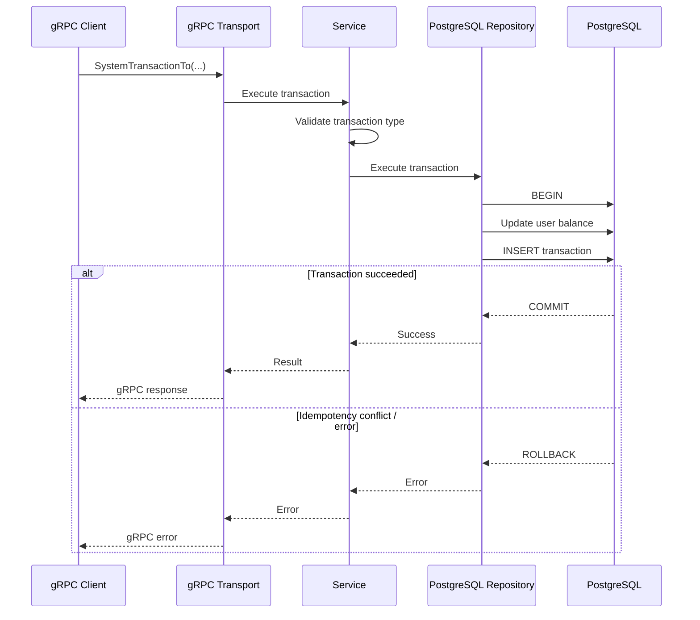

# Balance Service

gRPC микросервис для управления балансами пользователей и проведения транзакций.

## Возможности

- получение текущего баланса пользователя;
- пополнение баланса пользователя от системы;
- списание средств пользователя в пользу системы;
- переводы средств между пользователями;
- хранение истории транзакций;
- валидация типов транзакций через in-memory registry;
- идемпотентность транзакций;
- атомарное изменение баланса и создание записи транзакции;
- обработка конкурентных запросов.

## Стек

- **Go**
- **gRPC / Protocol Buffers**
- **PostgreSQL**
- **pgx**
- **Docker**
- **golang-migrate**
- **testify**

## Архитектура

Сервис разделён на транспортный, бизнес- и инфраструктурный слои.

```text
gRPC Client
     │
     ▼
┌───────────────┐
│ gRPC Transport│
└───────┬───────┘
        │
        ▼
┌───────────────┐
│ Service Layer │
└───────┬───────┘
        │
   ┌────┴─────┐
   ▼          ▼
Registry   Repository
   │          │
   └────┬─────┘
        ▼
   PostgreSQL
```

### Основные операции

Сервис поддерживает три типа операций:

```text
System ──────► User
System ◄────── User
User   ───────► User
```

Изменение баланса и соответствующая запись о транзакции выполняются атомарно в рамках одной PostgreSQL transaction.

### Выполнение системной транзакции



## Идемпотентность

Для системных операций используется `idempotency_key`.

Ключ передаётся клиентом вместе с запросом и сохраняется в таблице транзакций. В PostgreSQL на него установлено уникальное ограничение:

```sql
idempotency_key UUID UNIQUE NOT NULL
```

При повторной отправке операции с тем же ключом PostgreSQL предотвращает создание дубликата транзакции.

Изменение баланса и создание записи транзакции выполняются в одной database transaction. Поэтому при конфликте уникальности транзакция полностью откатывается и баланс не изменяется повторно.

## Конкурентность и тестирование

Для проверки корректности работы при конкурентных запросах реализованы интеграционные тесты.

Проверяются сценарии:

- конкурентные операции с разными `idempotency_key`;
- конкурентные операции с одним `idempotency_key`;
- конкурентные пополнения баланса;
- конкурентные списания средств;
- независимые операции для разных пользователей.

В тестах используется несколько параллельных gRPC-запросов, после выполнения которых проверяется итоговое состояние баланса и результат выполнения операций.

Например, при нескольких конкурентных запросах с одним `idempotency_key` фактически выполняется только одна операция.

## Transaction Type Registry

Типы транзакций хранятся в PostgreSQL.

При запуске приложения они загружаются из базы данных и преобразуются в in-memory registry.

Registry используется для:

- проверки существования типа транзакции;
- разделения системных и пользовательских операций на `System → User`, `User → System` и `User → User`;
- сопоставления типов транзакций с protobuf enum.

Это позволяет изменять набор доступных типов транзакций через данные в БД без изменения бизнес-логики сервиса.

## API

Основные RPC-методы:

| Метод | Назначение |
|---|---|
| `GetBalance` | Получение текущего баланса пользователя |
| `SystemTransactionTo` | Пополнение баланса пользователя от системы |
| `SystemTransactionFrom` | Списание средств пользователя в пользу системы |
| `TransactionToUser` | Перевод средств между пользователями |

Точный контракт API находится в каталоге [`protos`](./protos/proto).

## Структура проекта

```text
├── cmd/
├── config/
├── internal/
│   ├── adapter/
│   │   ├── postgres/
│   │   └── trxTypeRegistry/
|   ├── app/
│   ├── core/
│   ├── dto/
│   ├── grpc/
│   └── service/
├── migrations/
├── protos/
├── tests/
├── Makefile
└── go.mod
```

## Запуск

```bash
make run-app
```

## Тестирование

Запуск unit-тестов:

```bash
make cover
```

Запуск интеграционных тестов:

```bash
make integration-test
```

## Дальнейшее развитие

Возможные направления развития проекта:

- наладить запуск интеграционных тестов через docker-compose;
- интеграция с брокером сообщений при появлении сервисов-потребителей;
- использование Redis при появлении необходимости в кэшировании или rate limiting.
